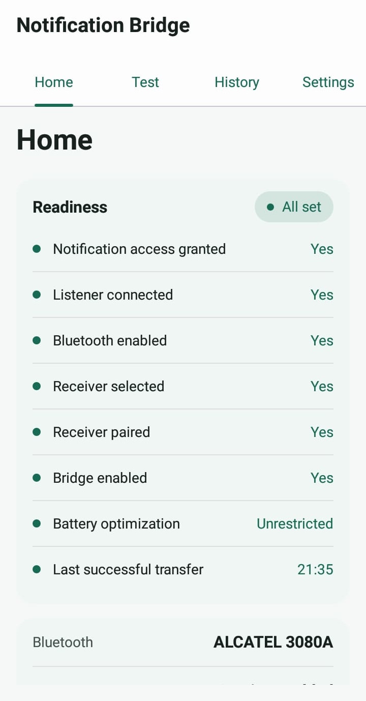
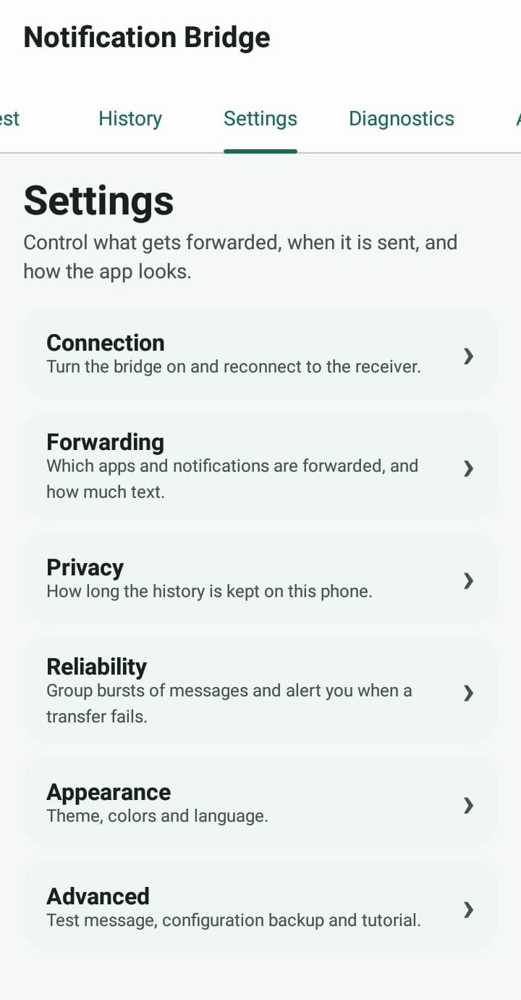

# Notification Bridge


Notification Bridge is an Android app that forwards your phone's notifications to a second device over Bluetooth. Each notification is sent as a small text file, or as a vMessage text message for phones that understand it, using OBEX Object Push, the file-transfer profile that basic phones have supported for more than twenty years. The receiving phone needs no app, no internet connection and no setup beyond pairing.

## Why

A basic phone makes a good secondary device if you want to disconnect, save battery, or just carry something simpler. The price is that you stop seeing WhatsApp, Telegram and email notifications, and you can't tell who is calling, unless you take out the smartphone.

Notification Bridge runs on the smartphone, watches its notifications and sends the basic phone one text file for each. Object Push is something that phone already knows how to receive, so nothing has to be installed on it.

## Features

- Forwards notifications from the apps you choose, plus incoming calls (native or VoIP, such as WhatsApp). Each one becomes a `.txt` file with the app name, title, text, date and time, or, if you choose, a vMessage (`.vmg`) that compatible phones file in their SMS inbox.
- Skips what you don't want: apps you haven't selected, silent notifications, ongoing ones (a music player, for example) and reposts of a notification it just sent.
- Limits each app to 10 transfers per minute, so a chatty app can't flood the Bluetooth link.
- Optional batching. After the first message from a conversation (same app, same title) the app waits 5 to 60 seconds and sends everything that arrived as one file. Calls are never batched.
- Two message formats (Settings → Forwarding → Message format): a plain text file that any receiver can open, or a vMessage that arrives as a text message on phones that support it. Text file is the default.
- Caps the length of the forwarded text. There are four presets, from 200 to 3000 characters.
- Retries failed transfers (up to three attempts while auto-reconnect is on) with a 15 second timeout per attempt, and pauses for five minutes after two failed notifications in a row.
- Dumbphone mode for unattended use: a minimal status notification, automatic reconnection, and an alert only when a transfer fails for good.
- A readiness checklist on Home that shows what is still missing, a History tab that explains failures in plain language and offers a Retry now action, and a Diagnostics tab with a report you can copy.
- A Receiver tab where you pick the receiver and send sample content (short text, long text, special characters or emoji), so you can check the Bluetooth path without waiting for a real notification.
- Configuration export and import, custom color themes, light and dark mode, and 11 languages: Spanish, English, French, Portuguese, Italian, Dutch, German, Japanese, Korean, Russian and Simplified Chinese.

The only receiver tested so far is an Alcatel 3080A. Other phones that accept Bluetooth OBEX Object Push should behave the same way, but they haven't been tried. The vMessage format in particular has not been confirmed on any real receiver yet, because phones differ in the vMessage variant they accept.

## Screenshots

<p align="center">
  
  &nbsp;&nbsp;
  
</p>

## Requirements

- A source phone running Android 7.1 (API 25) or newer.
- A receiver with Bluetooth Classic that accepts OBEX Object Push, paired with the source phone.
- To build the app: JDK 17 or newer and the included Gradle wrapper, or an Android Studio release recent enough for the Android Gradle Plugin version in `build.gradle.kts`.

## Installation

Build the APK as described under [Building](#building), then install it:

```bash
adb install app/build/outputs/apk/debug/app-debug.apk
```

You can also copy the APK to the phone and open it there. Android will ask you to allow installs from unknown sources for that file.

## Setup

1. **Pair the receiver.** Turn on Bluetooth on the receiving phone and make it discoverable. On the smartphone, open Android's Bluetooth settings, scan for devices and pair with the receiver, confirming the code if it asks for one. Pairing is done in the system settings, not in the app.
2. **Send a test.** In Notification Bridge, open the Receiver tab and tap Refresh devices. The first time, the app asks for Bluetooth permission and offers to turn Bluetooth on. Select the receiver and tap Send test file, then check that the file arrives. History will say "Transferred to device", which means the receiver's OBEX server accepted the file. It doesn't mean anyone has read it.
3. **Grant notification access.** On Home, tap Notification access and switch on Notification Bridge in the system settings. Back in the app, Home should show "Service enabled".
4. **Choose apps and turn the bridge on.** In Settings → Forwarding, select the apps whose notifications you want forwarded. Then switch on Enable bridge in Settings → Connection. It is off by default, on purpose.

The first-run tutorial covers the same steps, and you can reopen it from Settings → Advanced → Show tutorial. The Readiness panel on Home lists anything still missing and takes you to the screen that fixes it.

If you reinstall the app, for example with a new debug build, Android may not reconnect the notification listener even though the permission still shows as granted. If forwarding stops after a reinstall, switch notification access off and on again in the system settings.

## Configuration file

Settings → Advanced → Configuration file saves your setup to a plain text file and loads it back on another phone or build. The file holds the allowed apps, the filters, batching, maximum text length, message format, theme (including a custom palette), language and dumbphone mode. For the receiver you can save the name only (the default), nothing, or the name and the Bluetooth address. The address identifies the device, so leave it out if you plan to share the file.

Importing asks for confirmation first and shows the apps the file would allow. A file with an unknown, duplicate or out-of-range value is rejected as a whole. A receiver is selected only if it is already paired with the phone, matched by address or, if the file has none, by a name that belongs to exactly one paired device. The bridge switch, tutorial state, history retention, auto-reconnect, test content and the screenshot setting are not part of the file, so importing never changes them. In particular, it can't turn the bridge on.

## Custom themes

Settings → Appearance → Import theme file loads a color theme from a text file. Use built-in theme goes back to the app's own colors. The System, Light and Dark options still decide which of the two palettes is shown.

Theme files use `key: value` lines. Blank lines and lines starting with `#` are ignored. Version 1 needs a name (up to 40 characters) and all seven colors for both the light and dark palettes. Colors are written as `#RRGGBB` or `#AARRGGBB`. A file with an unknown or duplicate key, or one larger than 16 KB, is rejected, and the current theme stays as it was.

```text
version: 1
name: My Theme
light.foreground: #343B58
light.background: #D5D6DB
light.highlight: #2E7DE9
light.highlight-foreground: #FFFFFF
light.secondary: #9854F1
light.surface: #E1E2E7
light.error: #F52A65
dark.foreground: #C0CAF5
dark.background: #1A1B26
dark.highlight: #7AA2F7
dark.highlight-foreground: #1A1B26
dark.secondary: #BB9AF7
dark.surface: #24283B
dark.error: #F7768E
```

[`examples/tokyo-night.theme`](examples/tokyo-night.theme) is a complete example. More light and dark themes are available in the [notification-bridge-themes](https://github.com/yopo3r/notification-bridge-themes) repository.

## Permissions

| Permission | Used for |
|---|---|
| Notification access (`BIND_NOTIFICATION_LISTENER_SERVICE`) | Reading the notifications that get forwarded. You grant it in the system settings. |
| `BLUETOOTH_CONNECT` (Android 12+) | Listing paired devices and connecting to the receiver. |
| `BLUETOOTH_SCAN` (Android 12+) | Canceling any running discovery before connecting. Declared with `neverForLocation`, so the app doesn't need a location permission. |
| `BLUETOOTH`, `BLUETOOTH_ADMIN` (Android 11 and lower) | The older equivalents of the two above. |
| `POST_NOTIFICATIONS` (Android 13+) | The status notification and the failure alert. |
| `FOREGROUND_SERVICE`, `FOREGROUND_SERVICE_CONNECTED_DEVICE` | Keeping the listener service in the foreground so the system is less likely to stop it. |

The app has no `INTERNET` permission and no analytics or telemetry. The only data that leaves the phone is the `.txt` or `.vmg` file sent over Bluetooth to the receiver you chose.

## How it works

```
Android system notification
            │
            ▼
NotificationListenerService  (NotificationBridgeService)
            │  extracts app, title, text and category
            ▼
Filtering  (BridgeRuntime.enqueue)
            │  allowed apps, calls, silent, ongoing,
            │  duplicates, rate limit, batching
            ▼
Queue and worker  (BridgeRuntime)
            │  one transfer at a time, retries, timeout
            ▼
Bluetooth  (RFCOMM socket to the receiver's Object Push service)
            │
            ▼
OBEX Object Push  (CONNECT → PUT → DISCONNECT)
            │
            ▼
Receiver (for example an Alcatel 3080A) stores the .txt file
```

### From notification to file

1. Android calls `NotificationBridgeService.onNotificationPosted()` for every notification on the device. The service ignores the app's own notifications and group summaries (the notification that bundles several others), and extracts the app, title, text and category.
2. `BridgeRuntime.enqueue()` decides what happens next. It checks the master switch and the allowed-apps list, then the silent and ongoing filters, duplicate suppression and the per-app rate limit. Calls (category `call`) are the exception: they don't need to be in the allowed list, they skip the silent, ongoing and rate-limit checks, and the Notify calls setting controls them instead.
3. Whatever passes is queued. With batching on, a regular notification is first held for the cooldown and combined with the other messages from the same conversation, then queued as a single item.
4. A background worker takes queued items one at a time, builds the file (`NotificationFormatter` for a text file, `VMessageFormatter` for a vMessage, chosen by `OutgoingMessage`) and transfers it, retrying when it fails.

A file looks like this, and is named from the app, the first characters of the title, the time and a counter (`WA_Maria_213502_001.txt`):

```text
WHATSAPP
Maria

See you at 7?

06-10-2026 21:35:02
```

With the vMessage format, the same notification becomes a `.vmg` file (`WA_Maria_213502_002.vmg`, sent with the OBEX type `text/x-vmsg`) that follows the layout Nokia Series 40 phones use for an unread inbox message:

```text
BEGIN:VMSG
VERSION:1.1
X-IRMC-STATUS:UNREAD
X-IRMC-BOX:INBOX
X-NOK-DT:20261007T003502Z
BEGIN:VCARD
VERSION:2.1
N:WhatsApp
TEL:WhatsApp
END:VCARD
BEGIN:VENV
BEGIN:VBODY
Date:2026/10/06 21:35:02
Maria
See you at 7?
END:VBODY
END:VENV
END:VMSG
```

The sender is the app name, reduced to plain ASCII. The body is UTF-8. Lines end with CRLF, and a line of notification text that starts with `BEGIN:` or `END:` gets a backslash in front, so it can't close the message early. vMessage dialects differ from phone to phone, so this one may need adjusting for a given receiver.

### Bluetooth and OBEX

`ObexObjectPushClient` opens an RFCOMM socket to the paired device's Object Push service (UUID `00001105-0000-1000-8000-00805F9B34FB`, found with an SDP lookup) and runs the OBEX exchange by hand:

1. `CONNECT` opens the OBEX session and negotiates the packet size.
2. `PUT` sends the file name, MIME type and content, split across several packets when it doesn't fit in one.
3. `DISCONNECT` closes the session.

There is no OBEX library involved. Android doesn't expose OBEX in its public API, so `ObexProtocol` encodes and decodes the few packets that Object Push needs. A watchdog closes the socket if a transfer takes longer than 15 seconds. If closing the session fails after the receiver has already accepted the file, the transfer still counts as delivered and isn't retried, which is what keeps duplicates from appearing.

## Building

```bash
git clone https://github.com/yopo3r/notification-bridge.git
cd notification-bridge
./gradlew assembleDebug
```

The APK ends up in `app/build/outputs/apk/debug/`. You can also open the folder in Android Studio and run it from there. The Gradle wrapper downloads the Gradle version the project needs, so nothing else has to be installed. The project compiles and targets Android SDK 37.

Debug builds use the application ID `app.notificationbridge.debug`, so they install next to a release build instead of replacing it.

`./gradlew assembleRelease` builds a release APK, which stays unsigned unless a signing configuration is found. To sign it, create `release-signing.properties` in the project root with `storeFile`, `storePassword`, `keyAlias` and `keyPassword`. Keep that file and the keystore out of version control.

To run the checks:

```bash
./gradlew testDebugUnitTest lintDebug
python3 scripts/check_string_resources.py
```

The unit tests run on the plain JVM and need neither a device nor Bluetooth hardware. The Python script looks for unescaped apostrophes in the string resources (see Troubleshooting).

## Project layout

Most source files start with a header comment explaining what the class does and why it exists.

```
app/src/main/java/app/notificationbridge/
├── MainActivity.kt          Tab shell and the Home, Test and Settings screens
├── MainViewModel.kt         Adapter between the UI, the settings and BridgeRuntime
├── BridgeApplication.kt     Starts BridgeRuntime with the process
├── OnboardingScreen.kt      First-run tutorial
├── HistoryScreen.kt         Recent transfers, failure explanations and actions
├── DiagnosticsScreen.kt     Technical report with a copy button
├── AboutScreen.kt           Version, purpose and license
├── FailureText.kt           Failure reasons and actions mapped to string resources
├── bluetooth/
│   ├── ObexObjectPushClient.kt   RFCOMM socket and OBEX exchange
│   └── ObexProtocol.kt           OBEX packet encoding and decoding
├── config/ConfigFile.kt     Text format for configuration export and import
├── data/SettingsRepository.kt    Persistent settings (Jetpack DataStore)
├── diagnostics/DiagnosticsReport.kt   Allow-listed diagnostics text
├── format/NotificationFormatter.kt    Notification to text file content and name
│   ├── VMessageFormatter.kt          Notification to vMessage (.vmg)
│   └── OutgoingMessage.kt            Picks file name, type and bytes for the chosen format
├── model/                   Data models and FailureReason
├── notification/
│   ├── NotificationBridgeService.kt   Notification listener and foreground status
│   ├── NotificationChannels.kt        Channels for the app's own notifications
│   └── ErrorNotifier.kt               Failure alert used by dumbphone mode
├── queue/
│   ├── BridgeRuntime.kt     Queue, filters, retries, worker and UI state
│   ├── DuplicateDetector.kt, RateLimiter.kt, MessageBatch.kt
│   ├── TransferHistory.kt, RetentionPolicy.kt, RetryBuffer.kt
│   ├── FailureClassifier.kt     Exception to FailureReason
│   └── NotificationSamples.kt   Sample content for test sends
├── readiness/               Home readiness checklist model
└── ui/                      Shared Compose components, scrollbar, warning dialog, themes

app/src/main/res/values*/strings.xml    UI strings, one file per language
app/src/main/res/xml/locales_config.xml Languages offered in Android's per-app settings
app/src/test/                           Unit tests
scripts/check_string_resources.py       Checks string resources for unescaped apostrophes
examples/                               Example theme file
```

The formatter, the filters, the history helpers, configuration and theme parsing and the diagnostics report don't call the Android framework, so their unit tests run on the plain JVM.

## Known limitations

- On phones with aggressive battery management (MIUI and similar), you may have to enable Autostart and exclude the app from battery optimization, or the system will stop the listener in the background.
- Calls are detected through `CATEGORY_CALL`, Android's standard tag for call notifications. A dialer or VoIP app that doesn't set it won't have its calls forwarded.
- The vMessage format is only as compatible as the receiver's own parser. Some phones ignore a pushed `.vmg`, store it as a file, or show it with the wrong date or sender. If yours does, switch back to the text file.
- Only OBEX Object Push is implemented, not the other profiles (contacts, synchronization and so on).
- The transfer history is kept in memory and disappears when the app process ends.
- An app that exceeds 10 notifications per minute has the extra ones dropped, not delayed. The queue holds at most 100 transfers, and anything beyond that is dropped too.
- Below Android 13, the status and failure notifications may appear in the system language instead of the app language, because a service context doesn't follow per-app locales there.

## Troubleshooting

| Symptom | What to check |
|---|---|
| An app is missing from the allowed-apps list | Only apps that have a launcher icon are listed. |
| Nothing reaches the receiver, but Home looks fine | Enable bridge (Settings → Connection) is off by default. History also shows why a notification was dropped or rate-limited. |
| Forwarding stopped after a reinstall | Switch notification access off and on again in the system settings. |
| Notification access shows as granted, but nothing is forwarded | In Diagnostics, check Listener connected. If it says `no` while access says `yes`, toggle notification access off and on. |
| Transfers fail one after another, then everything pauses | After two failed notifications in a row, the app waits five minutes before trying again. Fix the cause (receiver off, out of range, Bluetooth disabled), then use Retry now in History. |
| Duplicates arrive | Check that Ignore duplicates is on. History and Diagnostics show what was sent, and a debug build logs every filter decision (`adb logcat -s BridgeRuntime`). |
| Some notifications from one app never arrive | The per-app limit is 10 per minute. History shows these as Rate-limited. |
| A call isn't forwarded | Check that Notify calls is on. If it is, the app may not tag its call notifications as `CATEGORY_CALL`. |
| The build fails to compile | Use JDK 17 or newer, and make sure `./gradlew` is executable (`chmod +x gradlew`). |
| The build fails with `Can not extract resource from com.android.aaptcompiler.ParsedResource@...` | A string resource has an unescaped apostrophe (`'` instead of `\'`). Run `python3 scripts/check_string_resources.py` to find which one. |

For anything else, open an issue as described in [CONTRIBUTING.md](CONTRIBUTING.md).

## Privacy

This section describes version 0.15.0 and can be checked against the source.

- Everything happens on the phone. The app has no `INTERNET` permission and no networking code, backend, analytics or crash reporting. The Bluetooth receiver you selected is the only place notification data is sent.
- The app never writes notification content to disk. Jetpack DataStore stores settings only: the receiver's name and Bluetooth address, the package names of allowed apps, and preferences. Android cloud backup and device-to-device transfer are turned off for app data.
- While a notification waits to be sent, its content is held in memory, in the queue or in a pending batch. It is dropped once the transfer succeeds or fails for good. A failed transfer that can be retried stays in the retry buffer for up to 10 minutes (five items at most) so that Retry now works. The queue holds at most 100 transfers and 20 pending batches, and Clear history also empties the retry buffer and the pending batches. All of it disappears when the process ends.
- The transfer history lists the app name, a short title (40 characters at most), the result and the error detail. It lives in memory only and never includes the message text. You can clear it yourself, or let it clear automatically (24 hours by default, from 1 hour to 7 days).
- Settings → Privacy → Hide in screenshots and recents blocks screenshots of the app and hides its preview in the recent-apps list. It is off by default.
- Debug builds write troubleshooting lines to logcat under the `BridgeRuntime` tag. They can contain package names, receiver addresses and file names derived from titles, so review them before sharing. Release builds don't log.
- Copy diagnostic info produces a report with the app version, the Android version and device model, the on or off state of the settings, counts, and whether transfers failed, without exception text or timestamps. It leaves out notification titles and text, the receiver's name and address, and the names of allowed apps. Read it before posting it publicly anyway.

What the receiver gets deserves a separate mention. The app connects through Android's secure RFCOMM socket, which requires a paired device, but it adds no encryption of its own. The receiver stores each notification as an ordinary text file or, with the vMessage format, as a text message in its inbox, and what happens to those files afterwards is outside the app's control. The app also doesn't try to recognize sensitive content such as one-time codes, so only allow apps whose notifications you are comfortable having on the receiver.

To report a security problem, see [SECURITY.md](SECURITY.md).

## Disclaimer

Notification Bridge is provided as is, without any warranty, including of reliability, availability or fitness for a particular purpose. Forwarding depends on Android, Bluetooth, the source app, the receiving device, system permissions, battery management and other factors outside the developer's control. Transfers can be delayed, duplicated, incomplete or fail entirely.

Do not rely on this app as your only way to receive urgent, emergency, safety-critical, medical, work-related or otherwise important communications. The developer is not responsible for missed or delayed calls, messages, notifications, alarms, reminders or other communications, or for any loss, damage, cost or inconvenience resulting from using, or being unable to use, the app. You are responsible for testing it on your own devices, checking the History and Diagnostics tabs, keeping other ways of being reached, and deciding whether the app suits your situation.

Nothing in this disclaimer excludes or limits liability where the law doesn't allow that.

## Contributing

Bug reports, ideas and pull requests are welcome. See [CONTRIBUTING.md](CONTRIBUTING.md). The history of changes is in [CHANGELOG.md](CHANGELOG.md).

## License

Released under the [MIT License](LICENSE).
